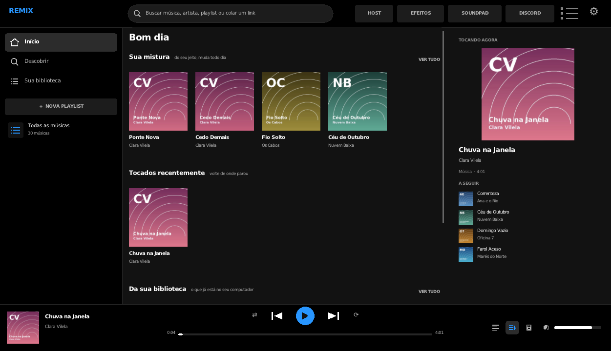
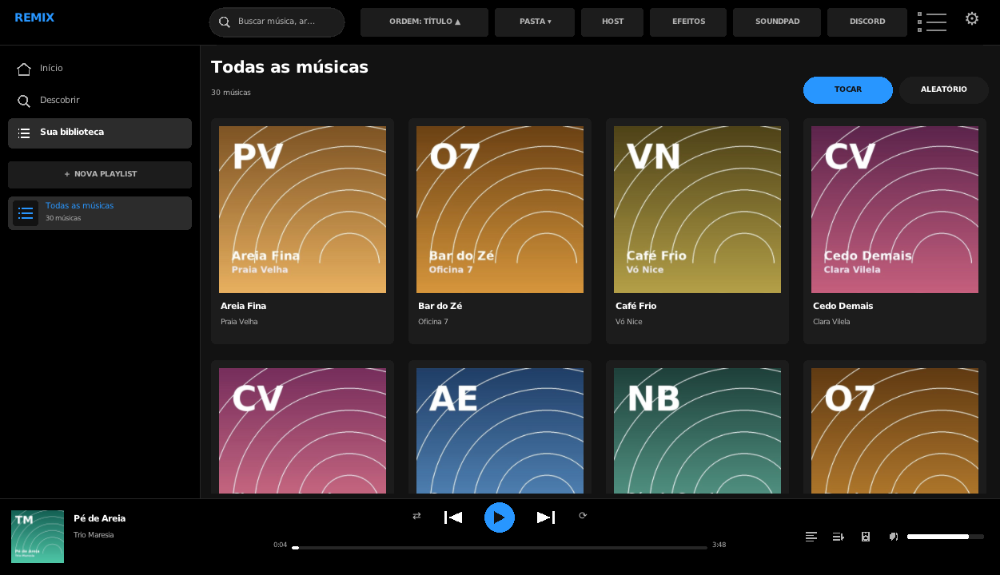
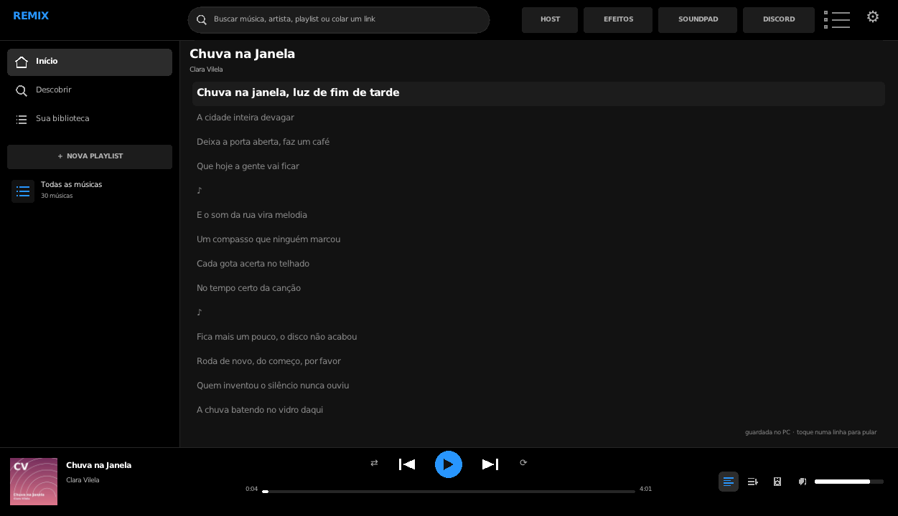
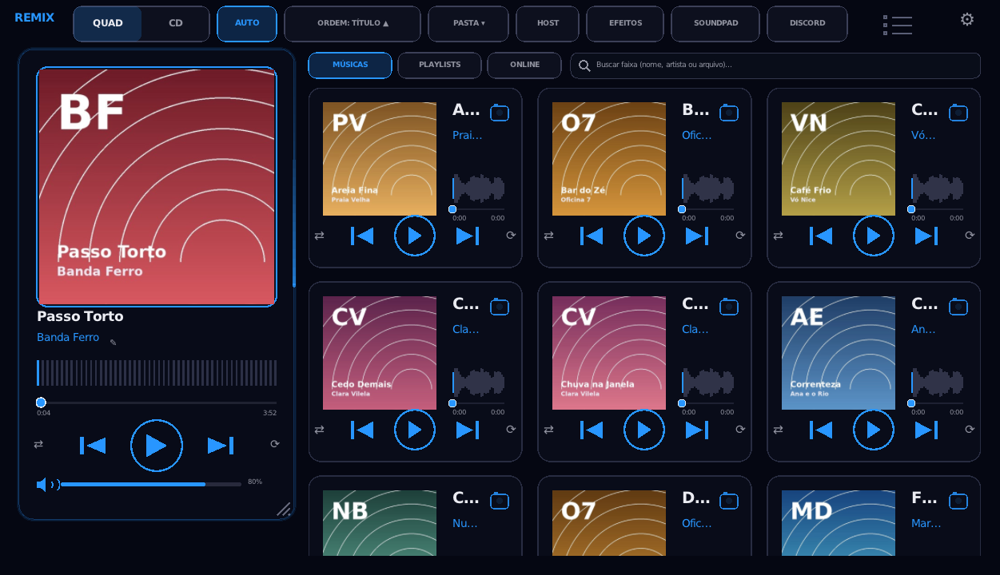

# Remix — Player de música multiplataforma

Busca e reproduz música do YouTube Music, YouTube e SoundCloud. Suporta arquivos locais.
Streaming e download de conteúdo adicional via CLI externa configurável pelo usuário.

Escrito em C++ (raylib + miniaudio). Biblioteca local, playlists, letras sincronizadas,
página de artista e novidades, e um modo **Host** para ouvir a biblioteca do PC pelo celular.

Pronto para baixar: [Releases](https://github.com/NinjaZinS2/Remix-Linux/releases).

## Como é organizado

| Pasta | O que tem |
|---|---|
| `linux/src/core/` | o núcleo: biblioteca, playlists, player, fontes externas, letras, novidades, Host |
| `linux/src/shell/` | a casca Linux (raylib, X11/Wayland, MPRIS) e os scripts de build e empacotamento |
| `linux/config/` | `config.exemplo.ini`: todas as chaves de configuração, comentadas |
| `linux/assets/` | fontes, ícones, temas e sons |
| `linux/docs/` | documentação e telas |
| `linux/dist/` | build pronto (gerado pelos scripts, fora do git) |

Tudo do app vive em `linux/`; a raiz fica livre para outra pasta (por exemplo `windows/`) no futuro.

## Compilar e rodar

```bash
bash linux/src/shell/fetch-deps.sh   # raylib e o compilador (uma vez)
bash linux/src/shell/build.sh        # -> linux/build/remix
linux/build/remix
```

Pacotes (`.rpm`, `.deb`, AppImage e zip portátil) em `linux/dist/`:

```bash
bash linux/src/shell/packaging/build-packages.sh
```

O `fetch-deps.sh` busca só a **cadeia de compilação** (código do raylib 5.5 e o compilador zig) para
`linux/third_party/`, sem root e sem tocar no sistema. Ele não instala nem baixa nenhum programa de
mídia: isso fica por sua conta (veja abaixo).

## Fontes externas (opcional)

O player local, as playlists e os arquivos funcionam sem nada instalado.

Para **buscar e reproduzir de fontes externas**, o Remix executa um programa de linha de comando
que **você** instala e configura — nada é distribuído, baixado ou embutido pelo app:

1. Instale, pela sua distro, um programa de linha de comando compatível — ele precisa aceitar
   `-j`/`-J`, `-f`, `-o`, `--flat-playlist`, `--playlist-items`, `--no-playlist`,
   `--ignore-config`, `--ffmpeg-location` e `--js-runtimes`, e imprimir JSON na saída padrão — e
   também o `ffmpeg`.
2. No Remix: **Configurações > PROGRAMA DE LINHA DE COMANDO > ESCOLHER O PROGRAMA...** (ou digite
   o caminho). O app testa o arquivo na hora e mostra a versão.
3. Sem isso configurado, as telas online avisam
   *"Configure uma CLI compatível para habilitar streaming de fontes externas"* e o resto do
   programa segue normal.

Reproduzir é a ação principal: o áudio é decodificado **em memória** (chunked), sem passar pelo
disco. Salvar uma cópia é uma ação secundária, sempre escolhida por você.

## Separar em partes (opcional)

O Remix toca vocal, bateria, baixo ou "só a música" usando um **separador que você instala e
aponta** em *Configurações > SEPARAR EM PARTES*: a linha de comando leva `{entrada}` (o arquivo) e
`{saida}` (a pasta), e o Remix reconhece cada parte pelo nome dos arquivos que aparecerem. Dá para
trocar de motor quando quiser — inclusive por um mais leve ou mais preciso — sem mexer no app, e
separadores que só fazem vocal + instrumental funcionam (as outras partes ficam marcadas como
indisponíveis).

Separar é a tarefa mais pesada do programa, então tem **teto de CPU**: o perfil (LEVE, o padrão,
EQUILIBRADO ou RÁPIDO) decide quantos núcleos a separação pode usar, e o processo roda com
prioridade baixa preso a esses núcleos. No perfil leve, com 12 núcleos, a separação fica em 3 — dá
para jogar enquanto isso.

<p align="center">
  
  
</p>
<p align="center">
  
  
  
</p>

<sub>As telas usam uma <b>biblioteca de exemplo</b>: músicas, artistas, capas e letra criados para a
documentação. Nenhuma obra, capa ou foto de terceiros aparece aqui.</sub>

## Créditos

<p align="center">
  <a href="https://github.com/Nero-2077"></a>
  <a href="https://github.com/NinjaZinS2"></a>
</p>

**[Nero-2077](https://github.com/Nero-2077)** criou o Remix: a ideia original e a versão Windows.
**Sodre** ([NinjaZinS2](https://github.com/NinjaZinS2)) entrou depois como co-desenvolvedor: participou da versão Windows,
sugeriu e desenvolveu as playlists e a música online (streaming e downloads), levou o Remix para o Linux e teve a ideia
do **Host** — o PC vira servidor para o celular — para o Remix chegar ao **iPhone (iOS) e a outros celulares** enquanto o Nero faz a versão Android.

## Interface

- **Estilo da interface** (Configuracoes > ESTILO DA INTERFACE): **Classico** (o visual
  original, com contorno da cor do tema, LED e transporte em cada card) e **REMIX** (1.6; no lugar
  dos antigos Limpo e Spotify + LED). O REMIX muda a tela inteira: barra lateral com Inicio,
  Descobrir, Sua biblioteca, + NOVA PLAYLIST e a lista de playlists; busca na barra de cima;
  area principal com a tela inicial de novidades ou a grade/lista da biblioteca; e o player numa
  barra embaixo, da largura toda (capa, titulo, transporte, tempo e volume). A escolha vale para
  O estilo escolhido fica em `Style=` no config.ini.
- **Tela inicial com novidades** (1.6): destaque no topo, atalhos para o que voce mais ouviu,
  **Sua mistura** (escolhida da sua propria biblioteca pelo que voce ouve, sorteada uma vez por dia)
  e fileiras como "O melhor de \<artista\>", "Parecido com \<artista\>" e "Dos artistas que voce
  ouve", junto com "Bombando agora", "Playlists da semana", "Albuns em alta" e "Artistas do
  momento". Em **Descobrir** da para navegar por genero e ver as paradas de cada estilo. Tudo vem
  da API publica do Deezer (sem login e sem chave) e so traz metadados: quem toca continua sendo o
  player do Remix, pela fonte externa que voce configurou. O que voce ouve fica em `gostos.ini`,
  so no seu PC.
- **Painel Tocando agora** (direita): capa grande, sobre o artista (foto, fas e parecidos) e o que
  vem depois na fila. Como as recomendacoes sao montadas: [linux/docs/DESCOBRIR.md](linux/docs/DESCOBRIR.md).
- **Letra sincronizada**: a linha atual fica em destaque acompanhando a musica e tocar numa linha
  pula para aquele ponto. Vem do LRCLIB (publico, sem conta) e fica guardada no disco para sempre,
  entao depois funciona ate sem internet. No celular tambem.
- **Listas com detalhe**: numero da faixa que vira equalizador animado na que esta tocando (play ao
  passar o mouse), capa, de onde vem a musica (pasta ou pilula ONLINE com o estado do canal) e a
  duracao.
- **Escolher onde o som sai** (fone, caixa, HDMI) pela barra do player, sem perder o ponto da musica.
- Barra lateral com largura ajustavel, e as playlists que voce mais abre aparecem primeiro.
- **Procurar playlists e albuns prontos** na busca online (abas MUSICAS / PLAYLISTS / ALBUNS), sem
  precisar sair do app.
- Modo **normal** redesenhado seguindo a referencia enviada: painel superior com Quadrado/CD e temas, seguido por cards de musica em grade.
- Modo **vertical** minimalista, focado somente na musica, com CD/capa menor, onda, seek, controles e engrenagem.
- O modo vertical pode voltar para **Quadrado** ou **CD** em Configuracoes.
- A janela continua redimensionavel pelas bordas/cantos.
- Escala geral, titulo, autor e vertical continuam independentes.
- Controle do LED permanece separado nas configuracoes.
- Cabecalho (1.1/1.2): Quadrado/CD, **AUTO** (autoplay), **ORDEM** da playlist, **PASTA**
  (trocar de pasta na hora, com pastas recentes), lista/grade, engrenagem e, no Windows,
  os botoes minimizar/fechar da janela sem borda.
- Volume com icone de alto-falante (clique = mudo) e porcentagem ao lado.
- Clique direito numa musica: tocar, trocar capa, renomear artista, **renomear o arquivo no
  disco**, abrir a pasta, **excluir (lixeira)** com confirmacao.
- Atalhos, com duas teclas para não disparar sem querer: Ctrl+Espaço (tocar/pausar), Ctrl+←/→
  (anterior/próxima), Ctrl+↑/↓ (volume), Ctrl+M (mudo), Ctrl+S (aleatório), Ctrl+R (repetir),
  Ctrl+0 (reiniciar a faixa), Ctrl+Del (excluir), Alt+↑/↓ (mover na ordem manual), Ctrl+F (buscar),
  F2 (renomear arquivo), Esc (fecha menus). Todos mudam em Configuracoes > ATALHOS; quem nunca
  mexeu nos atalhos recebe esse padrão novo sozinho.
- **MODO LEVE** em Configuracoes > EFEITOS: menos particulas/LED e 30 fps para PCs fracos.
- **Busca** (caixa acima da lista ou Ctrl+F): filtra por nome/artista/arquivo; Enter toca a primeira.
- **Playlists** (aba PLAYLISTS acima da lista): cada playlist e uma pasta em `playlists/`
  dentro da pasta de config, com um `playlist.json` que guarda so o caminho das musicas
  (nada e copiado nem apagado). Na playlist aberta, **+ ADICIONAR**: marcar musicas da
  biblioteca (clique nos cards e CONCLUIR), escolher arquivos, adicionar todas de uma pasta,
  **vincular uma pasta** (a playlist mostra sempre o conteudo atual dela), colar link ou buscar
  online. Com uma playlist aberta, o botao **PASTA DA PLAYLIST** do cabecalho mexe so nela (a
  biblioteca nao muda). **+ NOVA PLAYLIST**: vazia, de uma pasta, de um link ou da busca. No
  card, TOCAR / ALEATORIO, clique abre a lista, botao direito: pasta vinculada, sincronizar com
  o link, baixar as musicas online, modo online, renomear/excluir. Arquivo que mudou de pasta e
  reencontrado pelo nome e tamanho; se nao, o app avisa.
- **Atalhos configuraveis** (Configuracoes > ATALHOS): clique na tecla e pressione a nova
  combinacao; cada atalho pode ser FOCO (so com a janela ativa, padrao, nao atrapalha jogos)
  ou GLOBAL (funciona com outro programa na frente / em segundo plano; no Windows via
  RegisterHotKey). `Remix.exe --cmd next` manda um comando para a instancia aberta.
- **Aleatorio** e uma fila: a lista fica na sua ordem (inclusive manual); so a ordem de
  reproducao muda, cada faixa uma vez por ciclo.
- **Segundo plano**: fechar a janela com musica tocando esconde o player e ele continua
  tocando (Windows: icone na bandeja com menu; Linux: controles de midia do desktop).
  Abrir o Remix de novo traz a janela de volta; Ctrl+Q ou "SAIR DO REMIX" encerram.
  Teclas de midia do teclado funcionam. Tudo ajustavel em Configuracoes > REPRODUCAO
  (vem ligado; pode desligar).

## Volume, efeitos, stems e onda no ritmo

- **Volume seguro:** curva perceptiva (cúbica, a mesma do PipeWire/Pulse), subida de no máximo 40 dB por segundo e
  limitador em −0,3 dBFS. Antes o controle era linear (3% já era −30 dB): subir para 100% de uma vez dava +30 dB e
  podia estourar o fone; grave ou equalizador também podiam distorcer.
- **Efeitos (cabeçalho › EFEITOS):** Slow, Speed, Reverb, Grave e 8D, cada um com 3 níveis (cada clique sobe:
  1 → 2 → 3 → desliga). Slow e speed mudam velocidade e tom juntos (estilo "slowed"/"sped up") e não somam.
- **Stems (mesmo painel):** Completa, Só vocal, Só música, Bateria, Baixo e Outros, separados em segundo plano pelo
  Demucs (opcional, veja o instalador de dependências). Na CPU a primeira separação leva cerca de metade da duração
  da música; enquanto isso toca a completa, e quando termina o Remix troca para o stem no mesmo ponto. Fica guardado
  (até 3 GB): da segunda vez é na hora. Com um modo ligado, as próximas da fila já vão sendo separadas.
- **Onda no ritmo:** a altura vem da energia fina do áudio (25 ms), o "pulo" das batidas detectadas no espectro e o
  atraso da saída de som é descontado (antes lia 50 ms à frente e ainda adiantava até 4% ao longo da música).

## Seek e onda

- A onda usa a analise real do audio (decodificacao com miniaudio em thread, nos dois sistemas).
- O progresso possui knob visivel e e arrastavel.
- No modo normal, cada card tem sua propria barra de seek clicavel/arrastavel.
- No modo vertical, a barra principal e clicavel/arrastavel.

## Capas personalizadas

Cada musica possui um pequeno botao de foto/camera no card e no modo vertical.
Ao clicar:

1. abre o seletor de imagens;
2. voce escolhe JPG/PNG/BMP;
3. o programa **redimensiona** a imagem para ate 512 px e grava em `assets/covers/` (JPG q88 se opaca, PNG se tiver transparencia);
4. o player passa a carregar a copia interna;
5. o mapeamento fica salvo em `covers.ini`.

Assim, a capa personalizada nao depende do arquivo original continuar no mesmo local — e uma foto de celular de 4 MB vira ~100 KB em disco, sem diferenca visivel (a maior exibicao do player e ~300 px).

### Migracao automatica

Na inicializacao, capas antigas maiores que 512 px sao reencodadas no lugar
(mesmo nome/extensao, entao `covers.ini` continua valido). O original fica de
backup em `assets/covers/_originais/` — apague essa pasta quando quiser
liberar o espaco.

## Biblioteca padrao

Quando `MusicFolder=` fica vazio no `config.ini`, o player entra no modo **PADRAO** e procura
MP3/WAV/FLAC/OGG (e os formatos extras, se houver ffmpeg) nas **pastas do usuario**: Musicas,
Downloads, Documentos, Area de trabalho e pendrives/discos removiveis. Ele nao entra em pastas
de jogos e programas (Steam, AppData, node_modules, .git...), entao a varredura e rapida e nao
enche a lista de efeitos sonoros de jogo. Essa busca roda em segundo plano para nao travar a interface.

Em Configuracoes e possivel escolher uma pasta especifica. Ao fazer isso, o modo deixa de ser
padrao. O botao **PADRAO (PASTAS DO USUARIO)** restaura a busca automatica. O botao **PASTA**
do cabecalho faz a mesma troca sem abrir as configuracoes (pastas recentes, escolher outra
ou voltar ao padrao), e a pasta escolhida e monitorada: arquivos novos/removidos aparecem sozinhos.

## Fontes externas: buscar e reproduzir

Aba **ONLINE** (acima da lista) ou, numa playlist, **+ ADICIONAR > Buscar online / Colar link**.
Ctrl+V com um link em qualquer lugar do app tambem abre a busca. Tudo aqui depende da CLI que voce
configurou em **Configuracoes > PROGRAMA DE LINHA DE COMANDO**; sem ela, o Remix avisa e o resto do
app segue normal.

- **Busca** por nome no YouTube Music, YouTube ou SoundCloud (animacao de carregando enquanto a
  busca roda; os resultados aparecem conforme chegam). Cada resultado tem ▶ (tocar, a acao
  principal), + (colocar numa playlist) e ↓ (salvar uma copia); "ADICIONAR TODAS" guarda a lista
  inteira.
- **Links** de musica, album ou playlist: YouTube / YouTube Music e SoundCloud tocam direto;
  **Spotify** (pagina publica "embed": sem conta, sem chave, ~1 s), **Deezer** (API publica) e
  **Apple Music** (iTunes lookup) viram titulo + artista + duracao, e cada musica e procurada no
  YouTube Music na hora de tocar (o link tocavel achado fica salvo na playlist). O Remix nao
  contorna nem remove protecao de conteudo: o audio vem sempre da fonte publica que a CLI resolve.
- **Reproducao so na memoria**: a CLI devolve o endereco do audio e o ffmpeg decodifica para PCM
  direto na RAM (no maximo 6 min decodificados a frente e ~10 min no total; o que ja tocou e
  descartado). Fechar o app no meio nao deixa arquivo nenhum. Avancar/voltar (seek) funciona.
- **Fila**: a musica atual e as **proximas 2** (na ordem da lista ou do aleatorio) ficam cada uma no
  seu canal (CLI + ffmpeg + buffer na memoria). As da fila comecam em cascata (cada uma quando a
  anterior ja achou o audio), guardam ~75 s e esperam a vez com o ffmpeg parado; ao pular ou quando a
  musica acaba, a proxima sai **na hora** e o canal continua de onde parou. Na lista aparece
  TOCANDO / FILA: PRONTA / FILA: CARREGANDO com a barra do quanto ja carregou. Memoria: ~12 MB por
  musica da fila. Uma musica que falhou na fila e pulada sem esperar de novo.
- **Começo rápido**: a resolucao do endereco (~3 s, o que mais atrasava) fica guardada por 25 min e é
  usada pelo player, pelo celular (Host) e pela copia local; os 3 primeiros resultados de uma busca já
  são resolvidos em segundo plano. Tocar um deles começa em ~0,5 s em vez de ~3 s.
- **Salvar uma copia** (acao secundaria, sempre escolhida por voce): fila em segundo plano com
  **várias músicas ao mesmo tempo** (metade dos núcleos do processador, de 2 a 6), reaproveitando o
  que a reproducao ou a busca já resolveram. Pilula no canto inferior direito (clique = abrir a pasta
  ou cancelar). O arquivo e montado numa pasta temporaria do cache e so vai para a pasta final
  (`<Musicas>/Remix Online/<playlist>/`, configuravel) quando termina. MP3, M4A ou formato original,
  com titulo/artista/capa. Terminou: a entrada da playlist passa a apontar para o arquivo.
- **Tocar ou salvar**: Configuracoes > FONTES EXTERNAS ("AO TOCAR: STREAMING / BAIXAR") vale para
  tudo; cada playlist pode ter o proprio modo (pilula "ONLINE: ..." na barra da playlist ou botao
  direito no card); botao direito numa musica online tem "Salvar copia". Nesse modo ela ja toca
  enquanto a copia e feita.
- **Diario** (`remix/online/estado-XXXX.json` no cache, em `~/.cache`): gravado no maximo 1x por
  segundo e so quando algo muda, com o que esta tocando, como (URL direta ou pipe da CLI), onde
  (memoria), minuto, % do buffer, cada canal da fila (tocando ou fila, estado, ate onde recebeu) e
  cada copia em andamento (status, %, pasta temporaria, destino). Ao abrir, o app le o diario, apaga
  copias que ficaram pela metade (sem mexer nas de outro Remix aberto) e lembra a ultima musica
  online: ela aparece selecionada e a reproducao recomeca do inicio ao apertar play.

### O que voce precisa ter instalado

O Remix **nao instala, nao baixa e nao distribui** nenhum desses programas — todos vem da sua
distro (ou de onde voce quiser) e ficam sob o seu controle:

| Programa | Para que |
|---|---|
| uma CLI de midia compativel | achar o endereco do audio da fonte publica |
| `ffmpeg` | decodificar o audio e converter formatos |
| um "JavaScript runtime" (Deno 2.3+ ou Node.js 22+) | exigido hoje por algumas fontes |

Instale pelo gerenciador da sua distro (`apt`, `dnf`, `pacman`, `zypper`, `xbps`, `eopkg`, `nix`) e
depois aponte a CLI em **Configuracoes > PROGRAMA DE LINHA DE COMANDO > ESCOLHER O PROGRAMA...**.
O Remix testa o arquivo na hora, mostra a versao e passa a usar sem reiniciar; `ffmpeg` e o runtime
ele procura no `PATH`. Mantenha a CLI atualizada pela sua distro — as fontes publicas mudam.

## Capas dos proprios arquivos

A capa gravada dentro da musica (MP3/ID3, M4A/MP4, FLAC, OGG/Opus, WAV/AIFF) aparece sozinha: e
extraida em segundo plano para `remix/art/` no cache (reduzida a 512 px). Prioridade: capa escolhida
por voce > capa do arquivo > imagem da pasta (`cover.jpg` etc.). M4A tambem mostra titulo e artista.

## Arquivos gerados

- `config.ini` — modo, biblioteca, tema, volume, escalas, LED, autoplay, ordem, EQ, modo leve, pastas recentes.
- `covers.ini` — caminho interno das capas personalizadas.
- `artists.ini` — artistas editados a mao.
- `order.ini` — ordem manual da playlist.
- `assets/covers/` — copias das capas escolhidas pelo usuario.
- `soundpad/` — sons do Soundpad (copias) e `soundpad.ini`.
- `discord.ini` — opcoes e token do bot do Discord (permissao 600 no Linux; token protegido com DPAPI no Windows).
- Conversoes do ffmpeg (formatos extras) viram WAV temporarios numa pasta de cache, apagados sozinhos depois de 72 h.

## Compilacao

Baixe o codigo com `git clone https://github.com/NinjaZinS2/Remix-Linux.git`.

```bash
bash linux/src/shell/fetch-deps.sh    # raylib 5.5 e o zig (compilador) em linux/third_party/
bash linux/src/shell/build.sh         # -> linux/build/remix
bash linux/src/shell/build.sh --debug # com simbolos, sem otimizacao
```

O `build.sh` usa o **zig cc** quando existe (binario compativel com glibc >= 2.27, entao roda em
distro antiga) e cai no `g++` do sistema com `REMIX_TOOLCHAIN=gcc`. O audio (miniaudio +
stb_vorbis) e C puro e compila separado; o resto e um unico translation unit
(`linux/src/shell/main_linux.cpp`), o que deixa o build simples e rapido.

Pacotes:

```bash
bash linux/src/shell/packaging/build-packages.sh   # .deb, .rpm, AppImage e o zip portatil em linux/dist/
REMIX_VERSION=1.6.0 REMIX_RELEASE=2 bash linux/src/shell/packaging/build-packages.sh
```

> O `dnf`/`apt` nao troca um pacote pela mesma versao-release: ao entregar um build novo com a
> mesma versao, suba o `REMIX_RELEASE`.

## Host: ouvir as músicas do PC no celular (iPhone e Android)

Ideia do Sodre para o Remix funcionar no **iPhone (iOS)** — e em qualquer celular — sem app de loja, enquanto a versão
Android nativa é feita: o Remix do PC vira um **servidor** e o celular usa pelo navegador (dá para "adicionar à tela inicial").

- **Vincular:** Configurações > HOST (ou o botão **HOST** no cabeçalho) > **LIGAR**. No celular, **escaneie o QR code** do
  painel e digite só um nome — pronto. Sem o QR, abra o link, digite o **PIN** e aceite o aparelho no PC. O QR vale 10 min e
  uma vez só (opção **QR PEDE ACEITE** para exigir confirmação no PC também).
- **Você decide o que cada aparelho ouve:** por padrão um aparelho vinculado **não vê nada**. Libere a **BIBLIOTECA** por
  aparelho, hosteie playlists (botão direito > "Hostear no celular"; todos ou alguns aparelhos) e libere, se quiser, as
  playlists que um celular pediu para compartilhar. Cada celular tem as **playlists dele**, isoladas dos outros.
- **Interface de app de música no celular:** Início, Buscar, Sua Biblioteca, tela da playlist com voltar, **Tocando agora**
  em tela cheia e controles na tela de bloqueio, **efeitos e stems** aplicados pelo PC (o celular só toca o resultado,
  então a tela bloqueada do iPhone continua funcionando) e **onda no ritmo** calculada pelo PC. Ajustada para o **Safari do iPhone**: todo botão reage ao toque, a barra
  de posição funciona tocando ou arrastando em qualquer ponto, as folhas abrem o teclado e ficam acima dele, o play volta a
  funcionar depois de um erro e a página do WhatsApp mostra os links até na pré-visualização do iPhone (sem JavaScript).
- **Online no celular:** buscar e ouvir YouTube Music, YouTube e SoundCloud pelo celular — o **PC** roda a CLI
  configurada e o ffmpeg e manda só o áudio; playlists do PC com músicas online também tocam. O celular nunca fala com esses sites.
  Dá também para **colar um link de playlist ou álbum** (Spotify, YouTube, YouTube Music, Deezer, Apple Music,
  SoundCloud, Bandcamp): o PC resolve e o celular salva tudo como playlist dele com um toque.
- **Rede local e internet:** pelo mesmo roteador (Wi-Fi ou cabo) ou por um **túnel Cloudflare** (HTTPS, sem abrir porta,
  atravessa CGNAT, sem entregar seu IP). O link do túnel **só aparece depois de testado** (evita o erro de DNS
  `DNS_PROBE_POSSIBLE`) e tem botão **COPIAR LINK**; **NOVO LINK** gera outro. **HTML P/ WHATSAPP** gera uma página com os links.
- **Segurança:** só aceita conexões locais ou do túnel (mesmo com IP público), autorização por aparelho e por música
  (tirar a permissão corta na hora o que está tocando), aparelho sem "Lembrar" é temporário, trava contra adivinhar PIN/QR
  (por origem e geral), CSRF/XSS e DNS rebinding bloqueados, limites contra DoS e pedidos lentos, IPv6 opcional e só na rede local.
  Porta padrão **49875**. Detalhes, segurança e API em [linux/docs/HOST.md](linux/docs/HOST.md).

## Soundpad: sons no seu microfone (só no PC)

- Botão **SOUNDPAD** no cabeçalho (ou Configurações > SOUNDPAD E DISCORD): adicione sons (MP3, WAV, OGG e FLAC direto; M4A,
  Opus, WMA e outros são convertidos) e toque **no seu microfone** para o Discord, jogos e chamadas. Clique toca/para,
  teclas **1 a 9** com o painel aberto, volume por som, vários sons ao mesmo tempo, barra de progresso.
- **Linux:** o Remix cria o microfone virtual **Remix Microfone** no PipeWire/PulseAudio (`pactl`) e ele some ao desligar.
  **Windows:** usa o cabo virtual gratuito **VB-CABLE** (no Discord/jogo escolha "CABLE Output").
- **Minha voz** vai junto (o Remix nunca captura o próprio microfone virtual, então não dá eco) e **ouvir no fone** é
  opcional. Passo a passo em [linux/docs/SOUNDPAD.md](linux/docs/SOUNDPAD.md).

## Bot de música do Discord (só no PC)

- O **seu** bot no seu servidor: `/tocar` (nome ou link do YouTube, YouTube Music, SoundCloud, Spotify, Deezer, Apple Music),
  `/buscar` com menu de escolha, `/playlist` (só as playlists que você liberar), `/fila`, `/agora`, `/pular`, `/efeito`
  (slow, speed, reverb, grave, 8D) e mais — em português ou inglês conforme o Discord de cada pessoa.
- **Quem faz o trabalho é o PC**, com os mesmos mecanismos do Remix (busca, links, playlists, efeitos); o bot em Node.js é
  só a ponte com o Discord. Você decide: **fila pública**, **playlists para todos**, **músicas online**, **cargo DJ**,
  **limite por pessoa** e **votação** (por padrão mais da metade da chamada para pular a música dos outros, pausar ou
  parar) — ninguém atrapalha quem está ouvindo. Quem pediu a música pode pular a própria.
- No PC, **▶ DISCORD em cima da capa** (card de música ou de playlist) toca na hora onde você está numa chamada; o painel
  **DISCORD** mostra e controla o que toca em cada servidor. O Host do celular continua separado.
- Precisa do **Node.js 22.12+** e do `discord.js`, instalados por você (`npm i discord.js @discordjs/voice` na pasta
  `discord/` do Remix). O painel mostra o que falta e o comando a rodar. O token fica protegido (DPAPI no Windows, arquivo só do seu usuário no Linux). Passo a passo, comandos e
  segurança em [linux/docs/DISCORD.md](linux/docs/DISCORD.md).

## Segurança de arquivos (planejado)

Plano para proteger contra músicas com malware ou arquivos corrompidos — tocar só o que é reproduzível e a capa, higienizando o resto num processo isolado, sem quebrar o app — em [linux/docs/SEGURANCA-DE-ARQUIVOS.md](linux/docs/SEGURANCA-DE-ARQUIVOS.md). Ainda não implementado.

## Android (em andamento)

A estrutura para o porte Android (casca raylib reaproveitada, toolchain pinado em `third_party/android`, APK sem Gradle) esta em [linux/docs/ANDROID.md](linux/docs/ANDROID.md); o zip `docs/android-exemplo.zip` traz a pasta `android/` de exemplo.

## Linux (portátil, .deb, .rpm e AppImage)

O nucleo (`linux/src/core/`) e independente de sistema; a casca Linux (`linux/src/shell/`) usa
raylib, X11/Wayland e MPRIS. Guia completo em
[linux/src/shell/README-LINUX.md](linux/src/shell/README-LINUX.md).

Rodando de dentro da pasta do projeto, o app usa essa pasta como "casa" (`config.ini`,
`assets/`, `Musica/`). `bash linux/RODAR.sh` compila sozinho se o codigo mudou e abre.

```bash
linux/src/shell/fetch-deps.sh            # raylib 5.5 (+ patch do GLFW) + zig + headers X11/Wayland, tudo em third_party/ (sem root)
linux/src/shell/build.sh                 # -> build/remix e ./remix
linux/src/shell/packaging/build-packages.sh   # -> dist/*.deb, dist/*.rpm, dist/*-portable.zip e dist/Remix-*.AppImage
linux/src/shell/build-appimage.sh        # so o AppImage (um arquivo que roda em qualquer distro)
```

## Privacidade

Não tem conta, login, chave de API nem telemetria: o Remix nunca manda para lugar nenhum o que
você ouve. A biblioteca, as playlists, as capas, as letras baixadas e o `gostos.ini` (o que alimenta
as recomendações) ficam só na sua máquina, em `~/.config/remix` e no cache.

O app só fala com a internet quando você pede: metadados de novidades e artistas (API pública do
Deezer), letras (LRCLIB), páginas públicas de Spotify/Apple Music para ler o nome das faixas de um
link, e a fonte externa que você configurou. O Host é você quem liga, e cada aparelho precisa ser
autorizado.

Se preferir, desligue **NOVIDADES NO INÍCIO** em *Configurações > FONTES EXTERNAS*: aí o Remix não
busca nada sozinho e a tela inicial monta as fileiras com a sua própria biblioteca (Sua mistura,
Tocados recentemente, Da sua biblioteca).

## Como o projeto é organizado por dentro

- [linux/docs/ARQUITETURA.md](linux/docs/ARQUITETURA.md) — as camadas, a fronteira que executa
  programa externo e como conferir que nada escapa dela.
- [linux/docs/CONFORMIDADE.md](linux/docs/CONFORMIDADE.md) — a lista de verificação do projeto.
- [linux/docs/MUDANCAS-PARA-O-WINDOWS.md](linux/docs/MUDANCAS-PARA-O-WINDOWS.md) — o mesmo, para
  quem mantém a casca Windows.

## Licença

Apache License 2.0 — veja [LICENSE](LICENSE).

O Remix reproduz os arquivos que estão no seu computador e, quando você configura uma CLI compatível,
o que essa CLI resolve a partir de fontes públicas. Nenhum programa de terceiros é distribuído,
embutido ou baixado por este repositório, e o uso das fontes externas é responsabilidade de quem as
configura.
