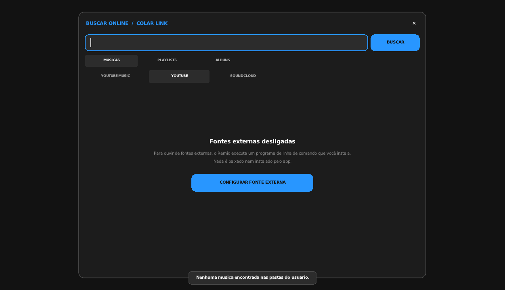
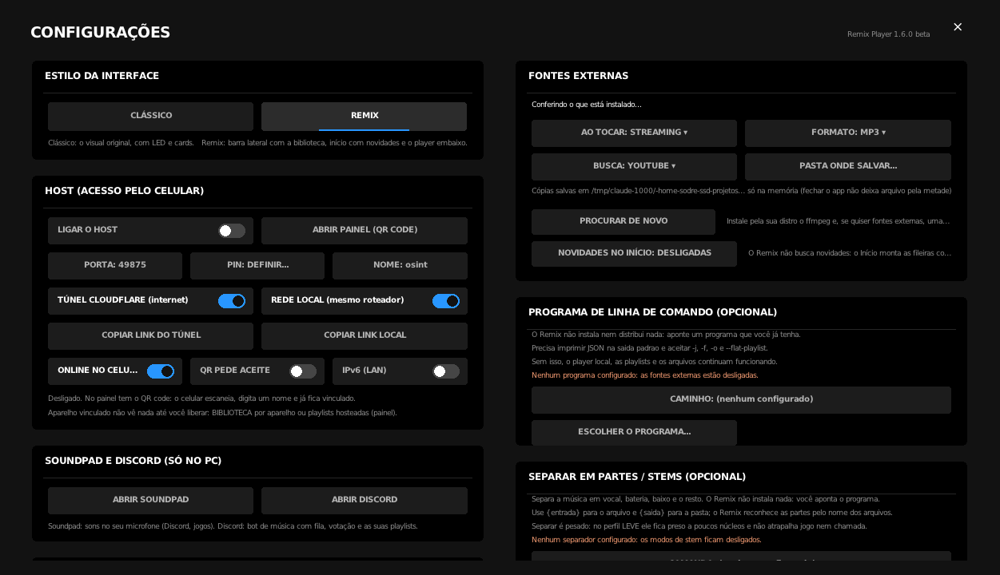

# Arquitetura do Remix

O Remix é um **player de música**. Tocar arquivo local e procurar/ouvir por link são as funções
principais; tudo que depende de um programa de terceiros é **opcional, desligado por padrão e
controlado pela pessoa**. Este documento explica como o código garante isso — não por boa vontade,
mas por estrutura: existe um único lugar que pode executar um programa externo, e ele não tem como
executar outra coisa.

---

## 1. As camadas

```
            ┌───────────────────────────────────────────────┐
  casca     │ src/shell/  (Linux: raylib, X11/Wayland, MPRIS)│  janela, desenho, diálogos
            └───────────────────────┬───────────────────────┘
                                    │
            ┌───────────────────────┴───────────────────────┐
  núcleo    │ src/core/   biblioteca · playlists · player    │  nada de sistema operacional
            │             novidades · letras · Host · bot    │
            └───────────────────────┬───────────────────────┘
                                    │  (única porta de saída)
            ┌───────────────────────┴───────────────────────┐
  fronteira │ src/core/fonte_externa.h                      │  executa programa de terceiros
            └───────────────────────┬───────────────────────┘
                                    │  processo separado, argv em vetor, sem shell
                        programa de linha de comando que a PESSOA instalou
```

O player local (`player_ma.h`, miniaudio), a biblioteca, as playlists, as capas, os temas, os
efeitos e o Host **não passam pela fronteira**: funcionam com a fronteira desligada.

---

## 2. A fronteira: `src/core/fonte_externa.h`

Regras que o arquivo implementa (estão escritas no cabeçalho dele também):

1. **O Remix não instala, não baixa, não atualiza e não embute programa nenhum.** Ele executa só o
   caminho que a pessoa escolheu em *Configurações > PROGRAMA DE LINHA DE COMANDO* (chave
   `MediaCli=` do `config.ini`). Vazio = fontes externas desligadas.
2. **Integração por processo, nunca por biblioteca.** `argv` em vetor, sem shell, e o Remix só lê o
   JSON que o programa imprime na saída padrão. Nenhum código de terceiros é ligado ao binário.
3. **Falha de um jeito só.** `fonte::Configurada() == false` e `fonte::MsgFalta(ctx)` explica o que
   fazer. Nenhuma outra parte do app pode inventar caminho alternativo, procurar o programa sozinha
   ou cair para outro executável.
4. **O app não conhece nenhum programa específico.** Ele publica o **contrato** em
   `fonte::Contrato()`: as opções que o programa precisa aceitar (`-j`/`-J`, `-f`, `-o`,
   `--flat-playlist`, `--playlist-items`, `--no-playlist`, `--ignore-config`,
   `--ffmpeg-location`, `--js-runtimes`) e JSON na saída padrão. Qualquer CLI que cumpra serve.
5. **Tocar é a ação principal**; salvar uma cópia é secundário e sempre escolha explícita.

### A API

| Função | O que faz |
|---|---|
| `fonte::Contrato()` | o texto do contrato, mostrado nas Configurações |
| `fonte::Garantir()` / `Reconferir()` | confere uma vez / confere de novo (depois de mudar o caminho) |
| `fonte::Configurada()` | existe um programa válido no caminho configurado? |
| `fonte::Caminho()` / `Versao()` | o que foi encontrado |
| `fonte::FfmpegOk()` / `Ffmpeg()` | ffmpeg (esse sim procurado no `PATH`: é utilitário genérico) |
| `fonte::MsgFalta(ctx)` | **a** mensagem de "desligado" (0 geral, 1 buscar, 2 link, 3 salvar) |
| `fonte::Cmd()` | argv base — **sempre** começa pelo caminho configurado; vazio se não houver |
| `fonte::CmdTocar(link)` | argv de "tocar sem gravar nada" (áudio para a saída padrão) |
| `fonte::Rodar(args,…)` | **executa e captura** — recusa se `args[0]` não for o caminho configurado |
| `fonte::Abrir(proc,args,…)` | o mesmo para o modo pipe (streaming) |

`Rodar` e `Abrir` são a trava: mesmo que algum código futuro monte um comando à mão, ele não roda
se o primeiro argumento não for exatamente o caminho que a pessoa configurou.

**Opções extras.** `--ffmpeg-location` e `--js-runtimes` não fazem parte do mínimo: ao configurar o
caminho, o app roda o programa uma vez com elas e, se não forem aceitas, para de mandá-las
(`Estado.extras`). Uma CLI que só cumpre o básico do contrato funciona igual.

### Quem usa

| Arquivo | Para quê |
|---|---|
| `online_resolve.h` | buscar, abrir link, casar música (só monta comando e lê JSON) |
| `online_play.h` | tocar da memória e salvar cópia |
| `host_server.h` | o celular pede, o PC resolve e manda só o áudio |
| `discord_host.h` | o bot pede, o PC resolve |
| `stems.h` | preparar o áudio de uma música online antes de separar |

Nenhum outro arquivo do núcleo executa a CLI. Conferir é um `grep` (seção 5).

### A outra fronteira: o separador de partes (`stems.h`)

Mesmas regras, outro programa. A pessoa configura uma **linha de comando** com `{entrada}` e
`{saida}` (`SepCmd` no `config.ini`); o Remix executa, lê a pasta e reconhece cada parte pelo nome
dos arquivos (vocal, instrumental, bateria, baixo, outros — em português ou inglês), convertendo
para FLAC no cache. Nada é instalado ou embutido pelo app, e um separador que só faça duas partes
funciona: as outras ficam marcadas como indisponíveis na interface.

Como separar é a tarefa mais pesada do programa, ela tem **teto de CPU**: `PerfilCpu()` (leve,
equilibrado, rápido) define quantos núcleos, e `ComLimiteDeCpu()` roda o processo com `nice -n 15`
e `taskset -c 0-(n-1)`. Assim o limite vale até para um separador que se autoconfigure — dentro do
`taskset`, o `nproc` dele já enxerga só os núcleos liberados.

---

## 3. Degradação graciosa

Sem CLI configurada:

- **continua funcionando**: biblioteca, playlists, capas, temas, efeitos, equalizador, letra de
  arquivo local, Soundpad, Rich Presence, Host (músicas locais), fileiras de novidades (metadados
  vêm da API pública do Deezer, sem login e sem chave);
- **fica desligado, com aviso**: buscar em fontes externas, abrir link, tocar item online, salvar
  cópia, músicas online no celular e no bot.

Na tela de busca online o app mostra um estado vazio com **CONFIGURAR FONTE EXTERNA**, que leva
direto às Configurações. O texto é sempre `fonte::MsgFalta()`.

<p align="center">
  
  
</p>

---

## 4. Vocabulário da interface

| Não usar | Usar |
|---|---|
| "baixador", "downloader" | "fonte externa", "programa de linha de comando" |
| "BAIXAR" como ação principal | "▶ tocar" primeiro; "↓ salvar uma cópia" depois |
| nome de um programa específico | o contrato (`fonte::Contrato()`) |

Na lista de resultados a ordem dos botões é **▶ (tocar) · + (playlist) · ↓ (salvar cópia)** e o
rodapé diz "▶ toca · + playlist · ↓ salva uma cópia". Em Configurações o par é
**AO TOCAR: STREAMING / SALVAR CÓPIA**. Salvar nunca é passo obrigatório para ouvir.

---

## 5. Como conferir (roda em qualquer máquina)

```bash
# 1. nenhum nome de programa de terceiros no repositório
#    (troque NOME pelo nome do programa que você usa; deve sair vazio)
grep -rli "NOME" --exclude-dir=.git --exclude-dir=third_party .

# 2. só a fronteira monta o comando do programa externo
grep -rln "fonte::Cmd()\|fonte::CmdTocar(" linux/src/ | grep -v fonte_externa.h

# 3. o núcleo nunca passa por shell (na casca há três usos com argumento fixo ou
#    entre aspas: xdg-open, gio trash e fc-match)
grep -rn "system(\|popen(" linux/src/core/

# 4. nenhum binário ou instalador no repositório
git ls-files | grep -iE "\.exe$|\.dll$|\.o$|instalar"

# 5. o pacote não depende de nenhum programa de mídia específico
rpm -qp --recommends linux/dist/remix-*.rpm ; dpkg-deb -I linux/dist/remix_*.deb | grep -i recommends
```

O 1, o 3 e o 4 saem vazios; o 2 lista os cinco arquivos da tabela acima mais `app_input.h`
(a ação de teste `fonte`, que prova a trava); o 5 pode citar
`ffmpeg`, `zenity`, `libcurl`, `deno`/`nodejs` — utilitários genéricos.

---

## 6. O que fica de fora, de propósito

- **Instalador de dependências**: não existe mais. Quem instala é a pessoa, pela distro.
- **Atualização automática de ferramenta**: não existe. Se a CLI falhar, o app mostra o erro e
  sugere atualizar pela distro.
- **Procurar o programa pelo disco**: não existe para a CLI de mídia. O botão *ESCOLHER O
  PROGRAMA...* abre um seletor de arquivo — a pessoa aponta, o app testa (`fonte::ExecutavelOk`) e
  guarda o caminho.
- **Biblioteca de terceiros ligada ao binário**: nunca. Só processo.

O `fetch-deps.sh` baixa a **cadeia de compilação** (código do raylib e o compilador zig) para
`linux/third_party/`. Isso é build, não runtime, e não tem nada a ver com mídia.
